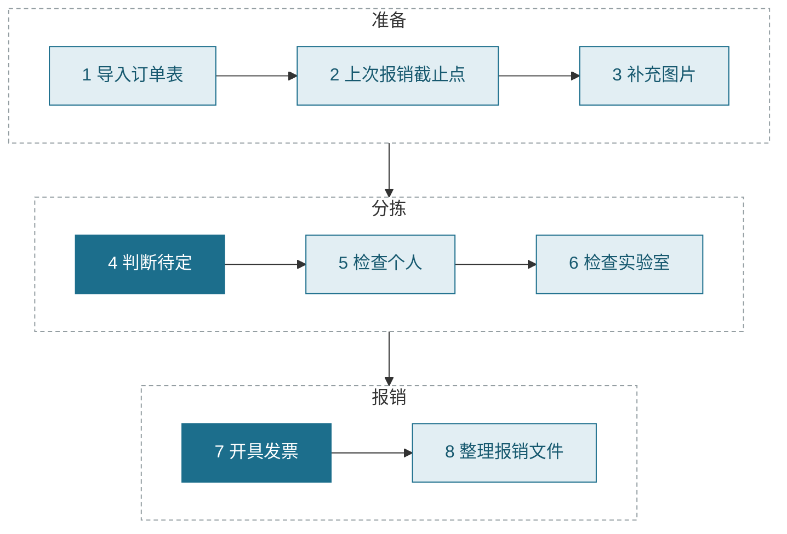
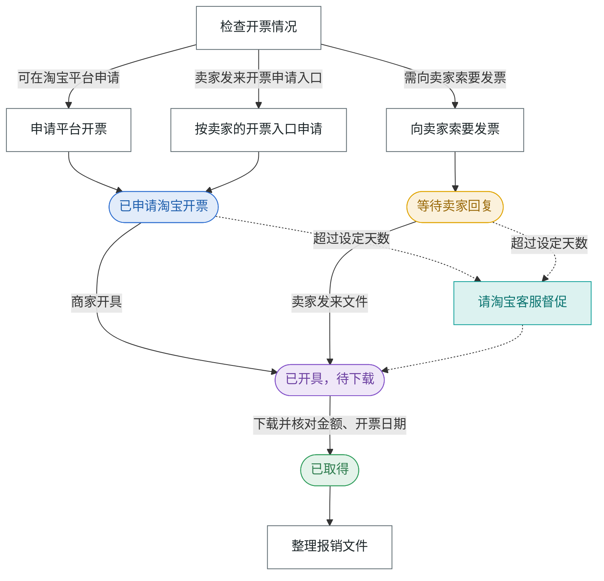
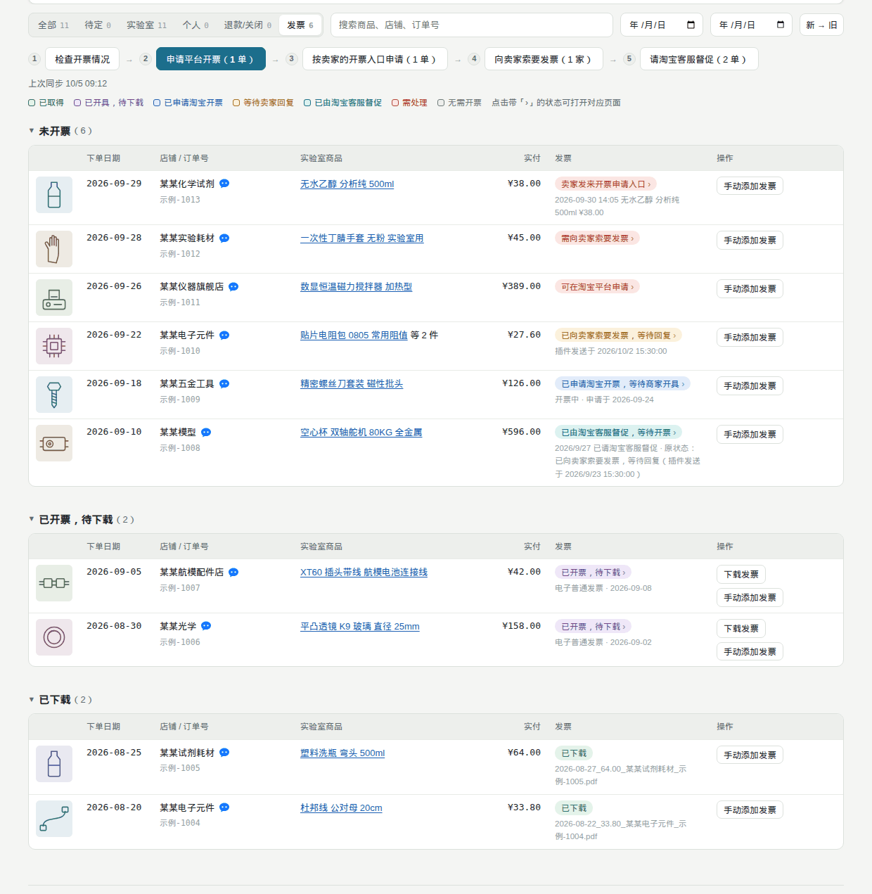

<p align="center">
  <picture>
    <source media="(prefers-color-scheme: dark)" srcset="docs/assets/banner-dark.png">
    
  </picture>
</p>

<p align="center">
  
  
  
  
  <a href="LICENSE"></a>
</p>

<p align="center">
  <a href="#功能">功能</a> · <a href="#安装">安装</a> · <a href="#工作流程">工作流程</a> · <a href="#发票处理">发票处理</a> · <a href="#隐私与权限">隐私</a> · <a href="#开发与测试">开发</a>
</p>

一个 Chrome 扩展，面向用个人淘宝账号为实验室垫付采购、需要定期报销的用户：把混在一起的订单分成实验室用品和个人用品，逐单跟踪发票的申请、索要和下载，最后整理成可直接提交的报销文件。所有数据只在本机浏览器中处理。

<p align="center">
  
</p>
<p align="center"><sub>载入示例数据 → 选择上次报销截止点 → 查看各步骤说明 → 进入待定商品列表。演示中的订单、店铺、发票均为虚构。</sub></p>

## 功能

<table>
<tr>
<td width="50%" valign="top">
<br>
<b>分拣</b><br>
按关键词自动判断实验室 / 个人，无法确定的放入「待定」；已判断的商品和店铺会被记住，用于后续订单。
</td>
<td width="50%" valign="top">
<br>
<b>退款识别</b><br>
按订单页上每件商品的退款文字逐件识别，部分退款（一单只退一件、一件买几个只退几个）也能识别，退款部分不计入报销。
</td>
</tr>
<tr>
<td valign="top">
<br>
<b>发票申请与下载</b><br>
同步淘宝「全部发票」中的开票记录，批量申请平台开票，下载已开具的发票并按订单命名。
</td>
<td valign="top">
<br>
<b>卖家开票入口</b><br>
识别卖家在旺旺中发来的「请填写发票申请」卡片，核对订单号和抬头后代为提交申请。
</td>
</tr>
<tr>
<td valign="top">
<br>
<b>向卖家索要</b><br>
平台无法开票的订单按店铺合并为一条消息，经确认后通过旺旺发送；自动下载卖家发来的 PDF，读取税务局发票二维码。
</td>
<td valign="top">
<br>
<b>客服督促</b><br>
超过设定天数仍未开票的订单，经确认后通过淘宝官方人工客服逐单督促。
</td>
</tr>
<tr>
<td valign="top">
<br>
<b>发票核对</b><br>
读取 PDF 上的金额、开票日期和发票号码，纠正归错订单的发票，识别多单合开和重复报销。
</td>
<td valign="top">
<br>
<b>报销文件整理</b><br>
按序号重命名发票，生成汇总表和压缩包。
</td>
</tr>
<tr>
<td valign="top">
<br>
<b>进度提醒</b><br>
主页顶部显示分拣、发票、金额进度；工具栏图标显示未取得发票的订单数，超期标红。
</td>
<td valign="top">
<br>
<b>纯本地</b><br>
无服务器、无账号、无上传或统计；不使用人工智能，全部为固定规则。
</td>
</tr>
</table>

## 安装

1. 打开 [Releases 发布页](https://github.com/jackdhch/taobao-order-triage/releases/latest)，在「Assets」下载 `order-triage-v版本号.zip`，右键「全部解压缩」到一个固定位置（例如「文档/订单分拣」）。之后不要移动或删除这个文件夹，Chrome 每次启动都从这里加载扩展。
2. 在 Chrome 地址栏输入 `chrome://extensions` 并回车，开启右上角「开发者模式」。
3. 点击「加载已解压的扩展程序」，选择解压出的文件夹（能直接看到 `manifest.json` 的那一层）。
4. 点击工具栏上的扩展图标，打开主页。
5. 在「设置 → 发票信息」中填写单位的发票抬头和税号。
6. 在淘宝「我的淘宝 → 已买到的宝贝」点击「导出订单」，将下载的 xlsx 拖入主页（或点击「导入订单表」）。

> [!IMPORTANT]
> 抬头和税号默认为空。未填写时，所有涉及发票的操作都会先停下并提示。

> [!NOTE]
> 没有自己的订单时，可在主页点击「载入示例数据」，用 8 单虚构订单试用界面。

<details>
<summary>更新到新版本</summary>

1. 先在主页「更多 → 备份数据」备份一次。
2. 在 [Releases 发布页](https://github.com/jackdhch/taobao-order-triage/releases/latest) 下载新版压缩包，解压后覆盖原来的文件夹（保持同一位置）。
3. 在 `chrome://extensions` 中找到「订单分拣」，点击刷新图标重新加载，然后刷新已打开的主页和淘宝页面。

数据保存在浏览器中，覆盖文件不会丢失数据；如果数据异常，用「更多 → 从备份恢复」恢复。

</details>

<details>
<summary>不安装扩展，直接打开网页</summary>

直接打开 `index.html` 也可以导入订单表并分拣，但发票功能都无法使用。补充图片时点击「补充图片 → 复制抓取脚本」，在已登录的淘宝「已买到的宝贝」页按 `F12` 打开控制台粘贴运行（Chrome 首次粘贴需先输入 `allow pasting`），在页面右下角的面板中点击「自动翻页」，完成后点击「保存 JSON」，将文件拖回主页。脚本只读取页面上已显示的内容，不调用接口、不读取 cookie、不发送任何数据。

</details>

## 工作流程

主页顶部按顺序列出八个步骤，当前步骤以黄色标出，每一步只有一个主按钮；不常用的操作收在右上角「更多」中。



| 步骤 | 做什么 | 主按钮 |
|---|---|---|
| 1　导入订单表 | 导入淘宝导出的 xlsx 或 csv。有新订单时重新导出并导入，已有判断保留 | 导入订单表 |
| 2　上次报销截止点 | 截止订单及更早的订单不再判断。导入以往整理好的发票文件夹即可自动识别，也可手动指定日期或选择「从第一单开始」 | 导入已整理的发票文件夹 |
| 3　补充图片 | 订单表中没有商品图片，也看不出逐件退款。在淘宝订单页点击右下角「开始补图片」，扩展自动翻页，带回图片和退款情况 | 打开淘宝订单页 |
| 4　判断待定 | 自动判断无法确定的商品，逐件按 `1`（实验室）或 `2`（个人）判断 | 判断待定商品 |
| 5　检查个人 | 核对判为个人的商品，判错的按 `1` 改正，然后点击「全部确认为个人」 | 检查个人商品 |
| 6　检查实验室 | 核对判为实验室的商品，判错的按 `2` 改正，然后点击「全部确认为实验室」。这些商品即本次报销范围 | 检查实验室商品 |
| 7　开具发票 | 见下文[发票处理](#发票处理) | 查看发票状态 |
| 8　整理报销文件 | 选择下载好的发票文件夹，预览新文件名，确认后生成报销文件夹和压缩包 | 选择发票文件夹并整理 |

<p align="center">
  
</p>
<p align="center"><sub>第 4～6 步：按 <kbd>1</kbd> / <kbd>2</kbd> 判断待定商品，再分别「全部确认为个人」「全部确认为实验室」。</sub></p>

列表中点击商品图片或商品名，在淘宝打开该订单的详情页；点击店名旁的旺旺图标，打开与该店铺的旺旺聊天。

<details>
<summary>判断规则与各步骤细节</summary>

**判断规则**

- 「补差价」「补邮费」「补拍」这类链接看不出买的是什么，一律放入待定，不沿用店铺或同名商品的判断。
- 同一家店有商品被判为实验室（且没有被判为个人的），该店之后的商品默认判为实验室。
- 已退款的商品自动排除。同一商品买了多件、订单页看不出退了几件时，可点击「仅部分退款」填写保留数量。

**第 2 步**：导入已整理的发票文件夹时，扩展读取每张 PDF 的发票号码、日期和金额，认出已报销的订单，以其中最晚的一单作为截止点；对上的订单之后不再下载发票，也不再找卖家。

**第 3 步**：遇到滑块或安全验证时自动停下，由用户手动完成后再次点击。淘宝只能导出最近几个月的订单表；更早的订单可点击「提取订单表之前的订单」，填写截至日期，从订单页上读取后建单。

**第 8 步**：见下文[整理报销文件](#整理报销文件)。

</details>

<details>
<summary>键盘操作</summary>

| 键 | 作用 |
|---|---|
| <kbd>1</kbd> / <kbd>L</kbd> | 判为实验室 |
| <kbd>2</kbd> / <kbd>P</kbd> | 判为个人 |
| <kbd>0</kbd> / <kbd>Backspace</kbd> | 撤回为自动判断 |
| <kbd>R</kbd> | 标记 / 取消退款（插件未识别出的退款） |
| <kbd>J</kbd> <kbd>K</kbd> / <kbd>↓</kbd> <kbd>↑</kbd> | 下一件 / 上一件 |
| <kbd>/</kbd> | 搜索 |
| <kbd>Ctrl</kbd>+<kbd>Z</kbd> | 撤销 |

</details>

## 发票处理

> [!NOTE]
> 发票功能需要以 Chrome 扩展方式安装，并已在「设置 → 发票信息」中填写抬头和税号。

需报销的订单（至少一件判为实验室、未退款）列在「发票」栏，分为「未开票」「已开票，待下载」「已下载」三组，每单显示一个状态。下载的发票存入下载文件夹的「订单分拣-发票」，文件名为 `日期_金额_店铺_订单号.pdf`。

<p align="center">
  
</p>
<p align="center"><sub>悬停带「›」的状态可看到点击后打开的页面；同步开票记录、下载发票后，状态和分组随之更新。</sub></p>



### 状态颜色

<table>
<tr><th width="190" align="left">图例</th><th align="left">包含的状态</th></tr>
<tr><td nowrap>&nbsp;已取得</td><td>已下载、已整理</td></tr>
<tr><td nowrap>&nbsp;已开具，待下载</td><td>已开票，待下载；已开纸质发票（无电子文件）；卖家已发送文件；卖家已发送图片（可能为二维码）</td></tr>
<tr><td nowrap>&nbsp;已申请淘宝开票</td><td>已申请淘宝开票，等待商家开具（淘宝显示的「申请中」「开票中」均归此类，进度原文写在说明中）</td></tr>
<tr><td nowrap>&nbsp;等待卖家回复</td><td>已向卖家索要发票，等待回复</td></tr>
<tr><td nowrap>&nbsp;已由淘宝客服督促</td><td>已由淘宝客服督促，等待开票</td></tr>
<tr><td nowrap>&nbsp;需处理</td><td>卖家发来开票申请入口；可在淘宝平台申请；需向卖家索要发票；卖家要求提供邮箱；已开票，抬头不符；疑似已整理，请核对；同店多单无法确定归属的；已下载但核对有误（如票面低于应报金额 1 元以上）</td></tr>
</table>

带「›」的状态可点击：等待卖家回复、卖家发来的内容打开与该店铺的旺旺聊天；已申请、已开票打开该订单的淘宝发票详情页；已由淘宝客服督促打开淘宝投诉记录；可在淘宝平台申请打开「批量开票」页。

### 五个按钮

发票栏顶部的五个按钮按处理顺序排列，当前应点击的一个显示为主按钮，括号内为待处理数量。

| 按钮 | 作用 |
|---|---|
| 检查开票情况 | 依次同步淘宝「全部发票」中已开具、申请中、未申请的记录，读取需卖家回复的旺旺会话，下载所有已开具的发票 |
| 申请平台开票 | 打开淘宝「批量开票」页，跨页勾选可在平台开票的订单，核对抬头和税号，选择「企业」「明细」，停在确认页。批量开票页上没有的订单改为需向卖家索要 |
| 按卖家的开票入口申请 | 针对卖家在旺旺中发来「请填写发票申请」卡片的订单：逐单打开会话，点击卡片上的「去申请」，在淘宝「开具发票」页核对后提交 |
| 向卖家索要发票 | 同一店铺的多单合并为一条消息（订单号、抬头、税号、邮箱），逐家通过旺旺发送；可选「自动发送」或「逐家手动发送」 |
| 请淘宝客服督促 | 超过设定天数仍未开票的订单：打开淘宝官方客服，转接人工后逐单发送督促消息（订单号、等待天数、抬头、税号） |

### 安全措施

> [!IMPORTANT]
> 会改变淘宝上状态的操作（提交开票申请、给卖家或客服发消息）都先列出清单，由用户确认后才执行；平台批量开票的「确认提交」由用户自己点击。

- **对外操作先确认清单**：向卖家索要发票、按卖家的开票入口申请、请淘宝客服督促，都会先列出清单（店铺、订单、要发送的内容），用户确认后才执行，可取消勾选不处理的项。
- **批量开票由用户提交**：申请平台开票只停在「批量开票确认」页，「确认提交」由用户自己点击。
- **提交前逐项核对**：向卖家发送前核对打开的会话确属该店铺（右侧「我的订单」中有这几单）；按开票入口提交前，等待默认抬头加载，核对网址中的订单号即为该单、页面上的抬头（和税号）与设置一致。任何一项不符即不发送、不提交，原因写在结果窗口和该单的说明中。
- **控制发送节奏**：自动发送时每家之间间隔 8～15 秒。
- **遇到安全验证即停**：出现滑块或验证码时停下，由用户在该页面手动处理。
- **减少打扰卖家**：打开旺旺会话会让卖家看到「已读」，因此只打开仍需卖家回复的店铺。

### 整理报销文件

第 8 步选择下载好的发票文件夹（如「订单分拣-发票」），扩展读取每张 PDF 的金额和开票日期，先预览新文件名，确认后再生成文件。

<p align="center">
  
</p>

- 新文件名为 `序号_开票日期_金额-商品摘要-数量件.pdf`。序号默认接续已整理发票中最大的序号；一张发票对应多单时写成 `261+262`。
- 文件存入下载文件夹的 `订单分拣-报销/批次名称_日期_合计/`，附 `汇总.csv`（尚无发票的实验室订单也列在其中），并生成同名 `.zip`。原发票文件不变。
- 单张超过 200 元的发票标为「低值品」，单独放入「低值品（单张超过200元）」子文件夹。

<details>
<summary>更多发票细节</summary>

- **部分退款自动计算**：一件商品买了多个、只退其中几个时，订单列表上只显示「退款成功」。检查开票情况前，扩展打开订单详情页，按「退款成功 支付宝¥退款金额 ￥单价 x数量」算出保留数量，报销金额随之调整。
- **从订单详情页读取卖家**：卖家旺旺名常与店名不同。给卖家发消息前，扩展先打开每单的订单详情页读取旺旺名，并检查是否已整单退款（订单表中的「交易成功」也可能已全额退款；各件退款合计不少于实付也视为整单退款），已退款的不再索要发票。天猫店的订单详情会跳转到 `trade.tmall.com`，同样可以读取。
- **开票卡片归属**：扩展读取旺旺时单独识别开票申请卡片，按商品标题对应到具体订单；同一店铺几单无法区分时标注「请核对归属」。提交成功的订单状态变为「已申请淘宝开票，等待商家开具」。
- **卖家发来的文件和二维码**：扫描旺旺时，找到索要发票之后卖家发来的文件，自动下载并按订单命名。卖家发来的图片在本机识别二维码；是税务局电子发票页面的，自动打开，核对购买方、税号、金额后下载 PDF。
- **下载后核对**：读取每张 PDF 的价税合计和开票日期，处理以下情况：同店多单时发票归错订单，自动移到正确的订单；多单合开一张发票；开票日期早于下单日期（属于以往订单）；与已整理（已报销）的发票号码相同；票面略高于实付（平台常按用券前价格开具），视为相符。
- **已有的发票**：「更多 → 核对已下载的发票…」按金额、日期和发票号码列出归属有误和重复的文件，扩展不修改、不删除用户的文件。邮件收到的发票，可在该单上点击「手动添加发票」，扩展复制一份并按该单命名存入「订单分拣-发票」。
- **每日自动处理**：在「设置 → 每日自动处理」中开启并选择时间。浏览器开启期间扩展每小时检查一次，过了设定时间且当天未运行时，自动执行一次「检查开票情况」。
- **进度和图标数字**：主页顶部显示发票已取得与应开的订单数，未取得的按「需处理 / 等待中 / 待下载」分别计数，超过设定天数的标红；工具栏图标显示同一数字，有超期订单时为红色。
- **旺旺页只保留一个**：淘宝网页版旺旺同一时间只能连接一个聊天页，打开第二个时旧的会断开。扩展只保留最新的一个，断开后自动刷新。
- **自动关闭工作页面**：扩展自行打开的页面（全部发票、批量开票、订单详情、二维码发票、开具发票 / 发票详情、官方客服）完成或停止后自动关闭；需要用户在该页处理安全验证的除外。用户自己点开的页面不会被关闭。

</details>

<details>
<summary>发票栏截图</summary>



</details>

## 设置

| 项目 | 说明 |
|---|---|
| 抬头（单位全称）、税号（统一社会信用代码） | 必填，默认为空。税号按统一社会信用代码的校验位检查 |
| 接收发票的邮箱 | 可留空；填写后，索要发票的消息中附带此邮箱 |
| 未开票超过几天需督促 | 默认 7 天。进度提醒和「请淘宝客服督促」按此天数计算 |
| 索要发票的消息模板 | 可使用 `{订单号}` `{日期}` `{金额}` `{抬头}` `{税号}` `{邮箱}`；同一店铺多单时自动合并为一条 |
| 每日自动处理 | 默认关闭；开启后选择每天几点，需保持浏览器开启 |

设置仅保存在本机浏览器中。

> [!WARNING]
> 全部数据（订单、判断、设置、开票与下载记录）只保存在本机浏览器中，删除扩展或清除浏览器数据后无法找回。可用「更多 → 备份数据」保存为一个 JSON 文件（存入下载文件夹的「订单分拣-备份」），重装或换电脑后用「更多 → 从备份恢复…」导入；进行中的任务（申请、发消息、下载等）不恢复。

界面随系统切换浅色 / 深色主题：

<table>
<tr>
<td width="50%"></td>
<td width="50%"></td>
</tr>
<tr>
<td align="center"><sub>浅色</sub></td>
<td align="center"><sub>深色</sub></td>
</tr>
</table>

## 隐私与权限

本工具的设计前提是数据不离开用户的电脑：

- 没有服务器、账号、上传、同步或统计代码，也没有人工智能功能，可直接阅读源码核实。
- 不加载外部脚本和字体。读取二维码（jsQR）和发票 PDF（Mozilla PDF.js）的开源库原样放在 `vendor/` 中。
- 分拣结果、设置、开票记录都保存在本机浏览器中。
- 商品图片直接从淘宝图片服务器加载，与用户自己打开淘宝相同。
- 会改变淘宝上状态的操作，都需要用户在主页点击按钮并在清单中确认后才开始；平台批量开票的「确认提交」由用户点击。

<details>
<summary>扩展申请的权限（见 <code>manifest.json</code>）</summary>

| 权限 | 用途 |
|---|---|
| `storage` | 在本机保存数据，在主页和淘宝页面之间传递任务和结果 |
| `downloads` | 将发票存入下载文件夹的「订单分拣-发票」并按订单命名，将整理好的报销文件存入「订单分拣-报销」，将备份数据存入「订单分拣-备份」 |
| `alarms` | 「每日自动处理」每小时检查一次是否到达设定时间 |
| `https://*.aliyuncs.com/*`、`https://invoice-ua.taobao.com/*` | 淘宝和卖家的发票 PDF 所在位置：下载、命名，并读取金额和开票日期用于核对 |
| `https://*.alicdn.com/*` | 淘宝图片服务器：读取卖家发来的图片，判断是否为发票二维码 |

</details>

<details>
<summary>扩展脚本运行的页面</summary>

| 页面 | 用途 |
|---|---|
| `buyertrade.taobao.com`（已买到的宝贝） | 补充商品图片、逐件退款状态、卖家旺旺名 |
| `i.taobao.com/my_itaobao/…`（我的发票、批量开票） | 同步开票记录、下载平台发票、批量申请 |
| `trade.taobao.com/trade/detail/…`、`trade.tmall.com/detail/…`（订单详情） | 读取卖家旺旺名，检查是否整单退款 |
| `market.m.taobao.com/app/im/…`（网页版旺旺） | 扫描卖家回复、下载卖家发送的文件、发送索要发票的消息、点击开票卡片的「去申请」 |
| `invoice-ua.taobao.com/e-invoice/…`（开具发票、发票详情） | 按卖家的开票入口申请：核对订单号和抬头后提交 |
| `ai.alimebot.taobao.com`（淘宝官方客服） | 请人工客服督促开票 |
| `*.chinatax.gov.cn`（税务局电子发票平台） | 打开卖家发送的发票二维码，核对后下载 PDF |

此外还匹配了本机 `127.0.0.1` / `localhost` 上的几个模拟页面，仅供离线测试使用。

</details>

## 已知限制

- 淘宝页面结构没有公开文档，扩展依靠页面上的文字和元素定位，淘宝改版后可能失效，需要调整。
- 淘宝只能导出最近几个月的订单表；更早的订单需在第 3 步从订单页读取。
- 淘宝网页版旺旺同一时间只能连接一个聊天页，打开第二个时旧的会断开；扩展只保留最新的一个，断开后自动刷新。
- 「请淘宝客服督促」中客服发来「填写开票申请」入口后的自动提交，以及「按卖家的开票入口申请」的部分环节，尚未在真实页面上完整验证。
- 纸质发票没有电子文件，需等待卖家寄送；单笔投诉的详情在电脑网页上看不到，只能在手机淘宝中查看。
- 「每日自动处理」只在浏览器开启时运行。
- 开发和测试使用 Chrome 与 Chromium，其他浏览器未经验证。

## 开发与测试

所有测试都离线运行，不连接淘宝、不联网；订单、店铺、发票全部为虚构数据，淘宝的各个页面由 `tools/` 下的模拟页代替。

<details>
<summary>测试命令</summary>

```bash
# 自检：读表格、合并规则、判断规则、发票逻辑（需要 Node.js 18 或更新）
node tools/selftest.mjs

# 端到端测试：带扩展启动无界面浏览器，在模拟页上走完整流程（需要 Python 3 和 Playwright）
python3 -m pip install playwright
python3 -m playwright install chromium
env -u TMPDIR python3 tools/e2e-mock.py      # 补图片、退款、自动翻页
env -u TMPDIR python3 tools/e2e-invoice.py   # 同步开票记录、扫描旺旺、下载改名、发消息、请淘宝客服督促、天猫订单详情
env -u TMPDIR python3 tools/e2e-apply.py     # 平台批量申请（停在确认页）、按卖家的开票入口申请、工作页面用完关闭
env -u TMPDIR python3 tools/e2e-extras.py    # 读取发票文件夹、核对重复、二维码
```

每个端到端测试约一到两分钟。`env -u TMPDIR` 是因为临时目录路径过长时浏览器会报错，路径不长时可以省略。

- 评估判断效果：`node tools/eval.mjs 订单数据.xlsx labels.json`，`labels.json` 格式为 `{ "lab": ["订单号", …], "personal": ["订单号", …] }`。

</details>

<details>
<summary>发布新版本</summary>

1. 改 `manifest.json` 的 `version`（`js/app.js` 的 `VERSION` 和 `tools/selftest.mjs` 里的版本号同步改），跑通全部测试。
2. `bash tools/make-release.sh`，生成 `dist/order-triage-v版本号.zip`（只含插件运行需要的文件和一份「安装说明.txt」）。
3. 提交、推送后：`gh release create v版本号 dist/order-triage-v版本号.zip --title "订单分拣 v版本号" --notes "更新内容……"`。

</details>

<details>
<summary>重新生成 README 图片</summary>

```bash
python3 -m pip install playwright pillow
env -u TMPDIR python3 tools/screenshots.py                # 横幅、截图、演示动图全部重新生成
env -u TMPDIR python3 tools/screenshots.py gifs           # 只生成其中一类：banner / shots / gifs
```

脚本在全新的临时浏览器配置中加载扩展，使用示例数据和虚构的开票记录（抬头「示例大学」），不联网。横幅由 `tools/readme-banner.html` 渲染，写入 `docs/assets/`；截图和动图写入 `docs/screenshots/`。动图中的鼠标指针、按键提示和说明文字是录制时临时叠加在页面上的，不属于扩展界面。

</details>

<details>
<summary>目录结构</summary>

```
manifest.json              Chrome 扩展清单（仓库根目录即扩展）
index.html                 主页
js/                        分拣与发票逻辑：读表格、订单整理、判断规则、发票核对、界面
extension/                 扩展在各淘宝页面上运行的脚本，以及后台的下载命名、图标数字
scraper/taobao-scraper.js  订单页抓取（补图片、逐件退款）
vendor/                    原样拷贝的开源库：jsQR、PDF.js（版本和许可证见 vendor/README.md）
tools/                     自检、端到端测试、模拟页面、README 图片生成脚本、虚构测试数据
docs/assets/               README 横幅、图标
docs/screenshots/          README 截图和演示动图
local-data/                本机数据目录（已被 .gitignore 忽略，不会提交）
```

</details>

## 免责声明

本项目不是淘宝官方工具；自动判断基于关键词，仅供参考，是否属于可报销的实验室物品以所在单位的报销规定为准。

## 许可证

[MIT](LICENSE)。`vendor/` 中的第三方库（jsQR、PDF.js）按各自的 Apache-2.0 许可证分发，许可证文本随附在各自目录中。
