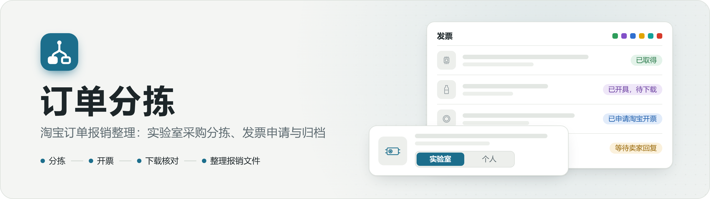
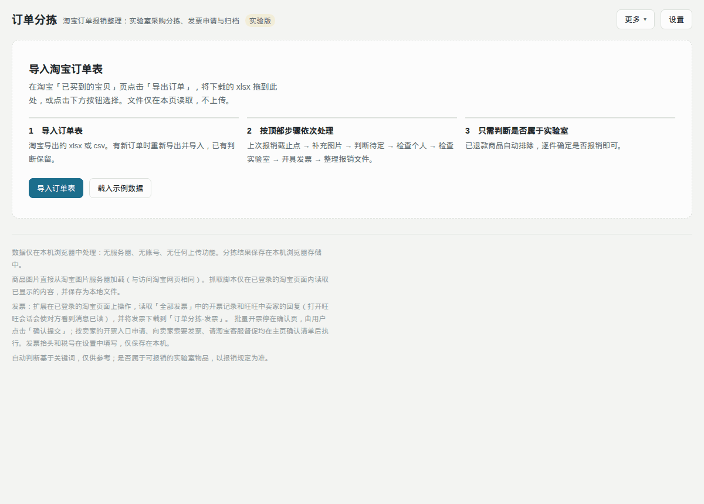
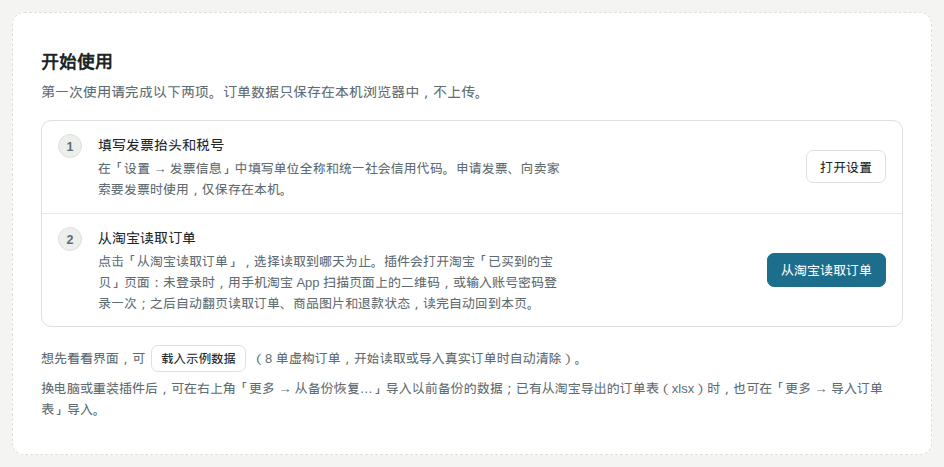
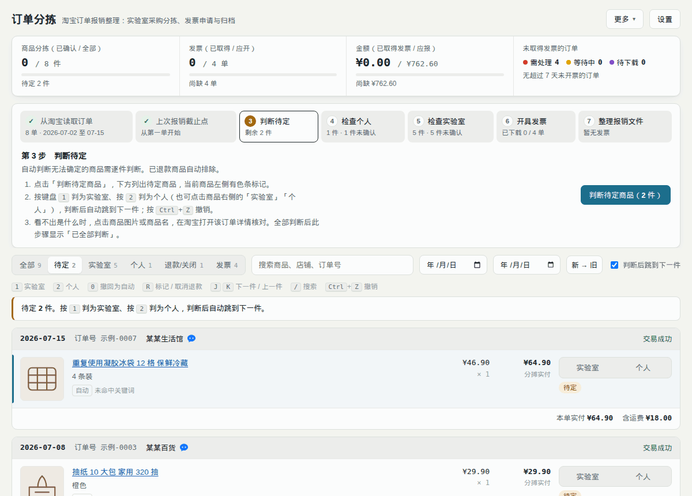
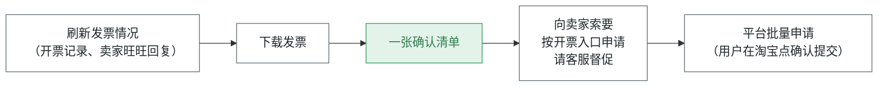
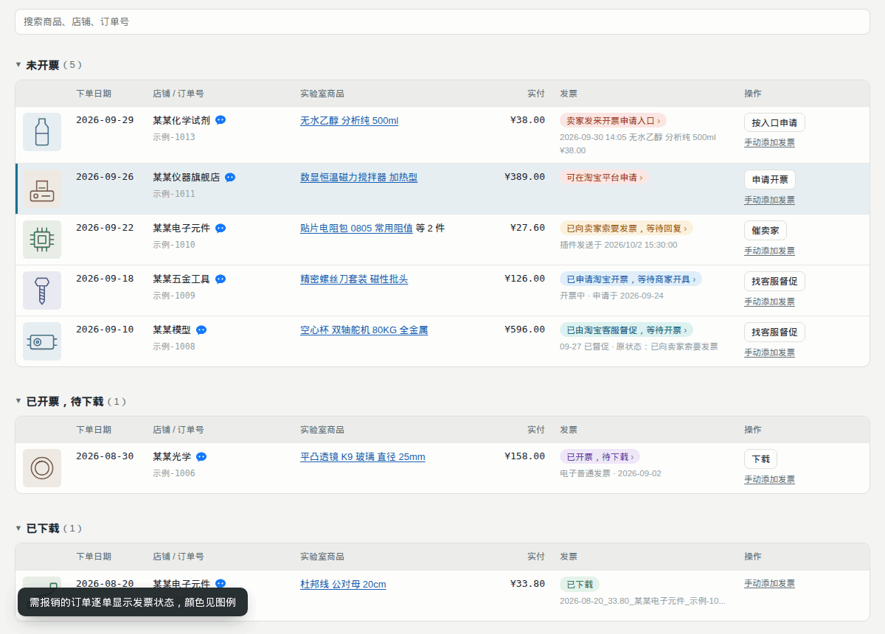
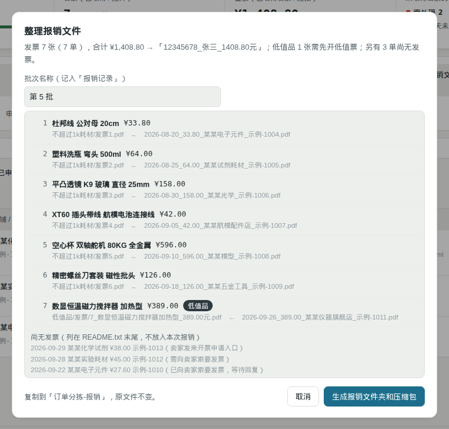
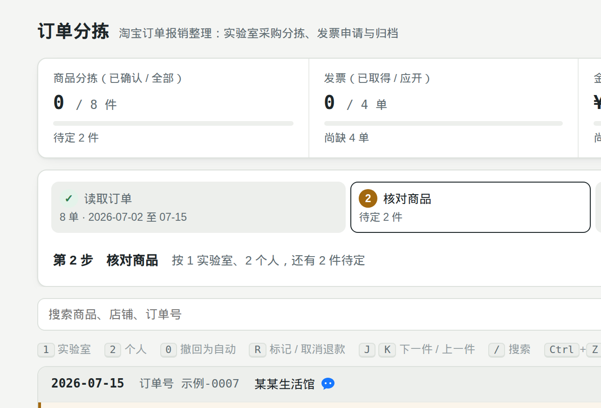
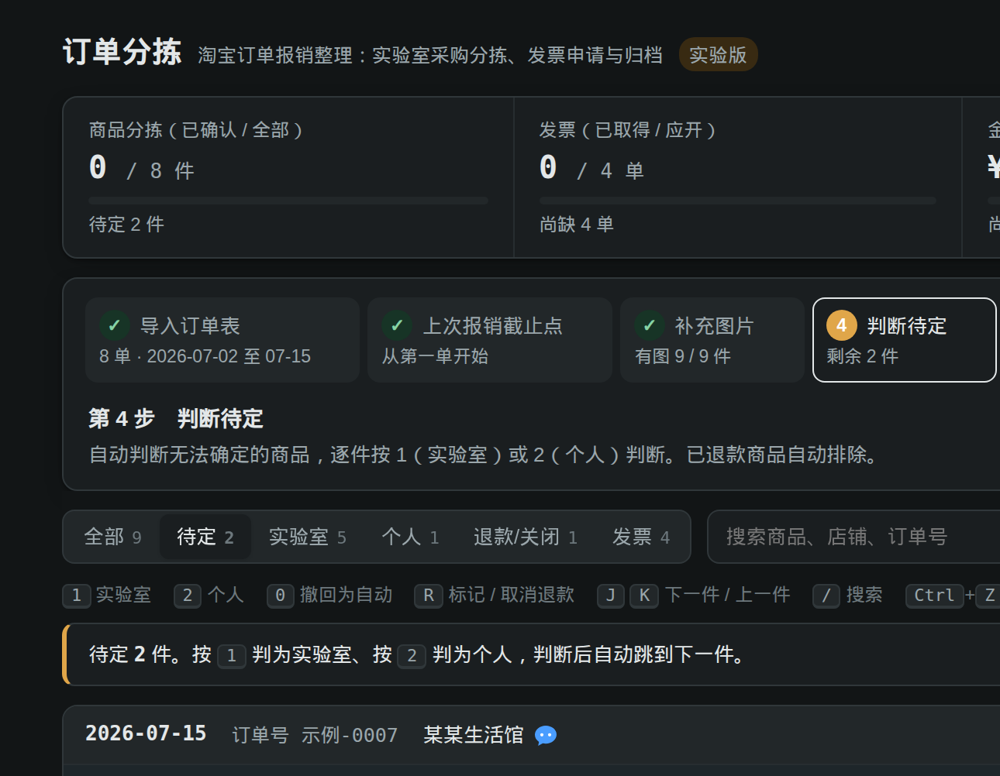

<p align="center">
  <picture>
    <source media="(prefers-color-scheme: dark)" srcset="docs/assets/banner-dark.png">
    
  </picture>
</p>

<p align="center">
  
  
  
  
  <a href="LICENSE"></a>
</p>

<p align="center">
  <a href="#功能">功能</a> · <a href="#安装">安装</a> · <a href="#工作流程">工作流程</a> · <a href="#发票处理">发票处理</a> · <a href="#隐私与权限">隐私</a> · <a href="#开发与测试">开发</a>
</p>

一个 Chrome 扩展，面向用个人淘宝账号为实验室垫付采购、需要定期报销的用户：把混在一起的订单分成实验室用品和个人用品，逐单跟踪发票的申请、索要和下载，最后整理成可直接提交的报销文件。所有数据只在本机浏览器中处理。

<p align="center">
  
</p>
<p align="center"><sub>四步：读取订单 → 核对商品 → 处理发票 → 整理报销文件。演示中的订单、店铺、发票均为虚构。</sub></p>

## 功能

<table>
<tr>
<td width="50%" valign="top">
<br>
<b>分拣</b><br>
自动判断实验室 / 个人，判不准的标黄待定；记住已判断的商品和店铺。
</td>
<td width="50%" valign="top">
<br>
<b>退款识别</b><br>
逐件识别退款，部分退款也能识别，退款部分不计入报销。
</td>
</tr>
<tr>
<td valign="top">
<br>
<b>发票申请与下载</b><br>
刷新开票情况，批量申请平台开票，下载发票并按订单命名。
</td>
<td valign="top">
<br>
<b>卖家开票入口</b><br>
识别卖家发来的开票卡片，核对订单号和抬头后提交申请。
</td>
</tr>
<tr>
<td valign="top">
<br>
<b>向卖家索要</b><br>
按店铺合并成一条消息经旺旺发送；自动下载卖家发来的发票。
</td>
<td valign="top">
<br>
<b>客服督促</b><br>
超期未开票的订单，转淘宝人工客服逐单督促。
</td>
</tr>
<tr>
<td valign="top">
<br>
<b>发票核对</b><br>
读取 PDF 金额和日期，纠正归错的发票，识别重复报销。
</td>
<td valign="top">
<br>
<b>报销文件整理</b><br>
按报销规范分类（耗材、低值品），自动截订单页面，生成 README 和报销清单；记录批次和到账。
</td>
</tr>
<tr>
<td valign="top">
<br>
<b>进度提醒</b><br>
顶部进度条和工具栏图标显示还缺几单发票，超期标红。
</td>
<td valign="top">
<br>
<b>纯本地</b><br>
无服务器、无上传；不用人工智能，全部为固定规则。
</td>
</tr>
</table>

## 安装

1. 在 [Releases 发布页](https://github.com/jackdhch/taobao-order-triage/releases/latest) 下载 `order-triage-v版本号.zip`，解压到一个固定位置（之后不要移动或删除）。
2. 在 Chrome 打开 `chrome://extensions`，开启右上角「开发者模式」。
3. 点击「加载已解压的扩展程序」，选择解压出的文件夹（能看到 `manifest.json` 的那一层）。
4. 点击工具栏上的扩展图标，打开主页。

### 第一次使用

1. 点「打开设置」，填写单位的发票抬头和税号，以及报销人姓名、学号（工程师可不填学号）。
2. 点「从淘宝读取订单」，填写上次报销到哪天，点「开始读取」。未登录时在打开的淘宝页扫码登录一次（也可先点顶栏「打开淘宝」登录），其余自动完成。

<p align="center">
  
</p>

> [!NOTE]
> 想先看看界面：点「载入示例数据」（8 单虚构订单，只看界面、不处理发票；开始读取真实订单时自动清除）。

<details>
<summary>更新到新版本</summary>

1. 先在主页「更多 → 备份数据」备份一次。
2. 下载新版压缩包，解压后覆盖原来的文件夹（保持同一位置）。
3. 在 `chrome://extensions` 中点「订单分拣」的刷新图标，然后刷新已打开的主页。

</details>

<details>
<summary>不安装扩展，直接打开网页</summary>

直接打开 `index.html` 只能分拣：导入从淘宝「已买到的宝贝」导出的 xlsx，用「补充图片 → 复制抓取脚本」在淘宝页的控制台补充图片。读取订单和发票功能需要安装扩展。

</details>

## 工作流程

主页顶部是一条线的四步，当前步骤标黄、完成的打勾；每步只有一个按钮。


| 步骤 | 按钮 | 插件做什么 | 用户做什么 |
|---|---|---|---|
| 1　读取订单 | 从淘宝读取订单 | 打开淘宝「已买到的宝贝」，自动翻页读取上次报销之后的订单、商品图片和逐件退款 | 填写上次报销到哪天；未登录时登录一次 |
| 2　核对商品 | 确认核对完成 | 按关键词自动判断实验室 / 个人，判不准的标为待定、排在最前 | 按 <kbd>1</kbd> / <kbd>2</kbd> 判完待定，点确认 |
| 3　处理发票 | 自动处理发票 | 刷新发票情况（开票记录、卖家回复）、下载发票；列出要申请、索要、督促的清单 | 确认一次清单；平台批量开票在淘宝页点「确认提交」 |
| 4　整理报销文件 | 选择发票文件夹并整理 | 按报销规范分类整理发票和附件，生成 README.txt、报销清单.xlsx 和压缩包，记一个报销批次 | 选择下载文件夹里的「订单分拣-发票」；到账后填写到账 |

插件运行的淘宝页面上有一个小按钮「← 订单分拣」，点击回到主页。

<p align="center">
  
</p>
<p align="center"><sub>核对商品：待定排在最前、标黄；按 <kbd>1</kbd> / <kbd>2</kbd> 判完后点「确认核对完成」。</sub></p>

<details>
<summary>颜色标签与判断规则</summary>

| 标签 | 含义 |
|---|---|
| 蓝「实验室」/ 粉「个人」 | 判断结果；虚线框表示自动判断、尚未确认 |
| 黄「待定」 | 判不准，需要人判断（整行标黄） |
| 灰「已退款」 | 按订单页上每件商品的退款文字识别，不计入报销 |
| 深色「低值品」/ 浅色「耗材」 | 单价超过 200 元的实验室商品；点标签可切换，同名商品以后沿用 |
| 黄「是否低值品？」 | 判断不出是设备还是耗材，和待定一样排在最前，点一下确认 |

- 「补差价」「补邮费」「补拍」这类链接一律待定。
- 同一家店有商品判为实验室的，该店之后的商品默认判为实验室。
- 同一商品买了多件、只退了几件时，可点「仅部分退款」填写保留数量。
- 订单列表上找不到的订单（多半已删除）不再要发票。
- 低值品：单件单价超过 200 元、发票明细里没有「模块」、属于设备器械（万用表、电子秤、示波器、焊台等）三条同时满足；耗材（电池、线材、螺丝、板材、传感器等）不算。关键词表见 `js/reimburse.js`。

</details>

<details>
<summary>键盘操作</summary>

| 键 | 作用 |
|---|---|
| <kbd>1</kbd> / <kbd>L</kbd> | 判为实验室 |
| <kbd>2</kbd> / <kbd>P</kbd> | 判为个人 |
| <kbd>0</kbd> / <kbd>Backspace</kbd> | 撤回为自动判断 |
| <kbd>R</kbd> | 标记 / 取消退款 |
| <kbd>J</kbd> <kbd>K</kbd> / <kbd>↓</kbd> <kbd>↑</kbd> | 下一件 / 上一件 |
| <kbd>/</kbd> | 搜索 |
| <kbd>Ctrl</kbd>+<kbd>Z</kbd> | 撤销 |

</details>

## 发票处理

点一次「自动处理发票」：



需要在淘宝上提交或发送的操作，按「向卖家索要 / 按卖家的开票入口申请 / 请淘宝客服督促 / 申请平台开票」分组列在一张清单里，可取消勾选；确认一次后自动依次完成。插件无法处理的订单也列在清单里。下载的发票存入下载文件夹的「订单分拣-发票」。处理时步骤条下方显示当前第几段、在等什么；结束后逐段列出结果。

<p align="center">
  
</p>

| 颜色 | 状态 |
|---|---|
|  绿 | 已取得（已下载、已整理） |
|  紫 | 已开具，待下载 |
|  蓝 | 已申请淘宝开票 |
|  黄 | 等待卖家回复 |
|  青 | 已由淘宝客服督促 |
|  红 | 需处理（含下载的发票核对不通过、旺旺会话未能读取；下次「自动处理发票」会列进清单） |

发票状态下方另有报销材料标签：

| 标签 | 含义 |
|---|---|
| 深色「低值品」 | 需先开低值票，整理时放入「低值品」 |
| 橙「需补支付记录」 | 价税合计超过 1000 元：订单页面由插件自动截图，支付记录（支付宝账单截图）在该行「手动添加发票 / 附件」补上 |
| 橙「需用途说明」 | 开票内容含「玩具」「体育用品」「家具」等字样：整理时自动生成 Word 用途说明草稿（文末附订单截图），填写用途后按要求盖章 |
| 橙「需3D打印明细」 | 3D 打印订单：向卖家索要发票时插件在消息末尾追加一句索要明细；卖家在旺旺发来的表格自动挂上 |

带「›」的状态可点击，打开该单对应的淘宝页面。发票表每行的「操作」按状态只有一个：

| 状态 | 操作 |
|---|---|
| 已开具，待下载 / 卖家已发送文件 | 下载 |
| 等待卖家回复 | 催卖家（在旺旺输入框填好一句催促，由用户点发送） |
| 已申请淘宝开票 / 已由淘宝客服督促 / 超过设定天数 | 找客服督促 |
| 需处理 | 索要发票、申请开票、按入口申请、换开发票、联系卖家或打开旺旺 |

> [!IMPORTANT]
> 提交申请、给卖家或客服发消息都先在清单中确认；平台批量开票的「确认提交」由用户在淘宝页面点击。

<details>
<summary>安全措施与细节</summary>

- 发送前核对打开的会话属于该店铺；按开票入口提交前核对订单号和抬头。任何一项不符即不发送、不提交。
- 自动发送时每家间隔 8～15 秒；出现滑块或验证码时停下，由用户处理。
- 只打开仍需卖家回复的旺旺会话（打开会让卖家看到「已读」）；旺旺页只保留一个。
- 下载后读取 PDF 的金额和开票日期，按实付减退款核对：归错的订单自动更正，同店合开的几单都算取得；不是发票的退回「需向卖家索要」，票面少 1 元以上的标红。
- 卖家发来的图片在本机识别二维码；是税务局电子发票的，核对后下载 PDF。
- 卖家发到邮箱的发票、支付记录截图等附件：在该单点「手动添加发票」（需补材料时为「手动添加发票 / 附件」），插件按文件判断是发票还是附件。
- 「设置 → 每天自动刷新发票情况」：每天定时刷新、下载，不提交、不发送。
- 插件打开的淘宝页面做完自动关闭；用户自己打开的不关。

</details>

### 整理报销文件

<p align="center">
  
</p>

按报销规范存入 `订单分拣-报销/`，附同名 `.zip`，原文件不变：

```
学号_姓名_总金额元/            （没有学号时：姓名_总金额元）
  README.txt                    报销人、总金额、各分类合计、特殊情况、逐项明细
  报销清单.xlsx
  不超过1k耗材/发票1.pdf、发票2.pdf…
  超过1k耗材/发票/、附件原图/   订单页面截图、支付记录、用途说明、3D 打印明细
  低值品/发票/、附件原图/
```

- 没填报销人姓名时，先打开设置。有「是否低值品？」的票先在预览里点一下确认。
- 整理后这一批记为已整理（「已整理（第 N 批）」），第 4 步下方「报销记录」每批一行：待到账（黄）/ 已到账（绿）/ 有差额（红）；「填写到账」可分次填。有差额时自动找出金额正好相加等于差额的几张票。
- 「更多 → 导入已整理的发票文件夹」时，`YYMMDD_……第X批……_金额_报销给某人` 形式的子文件夹自动记为历史批次。

## 设置与数据

| 项目 | 说明 |
|---|---|
| 报销人姓名、学号 | 整理报销文件时必填姓名；学号可空（工程师） |
| 抬头、税号 | 必填，默认为空；税号按校验位检查 |
| 接收发票的邮箱 | 可留空；卖家要求邮箱时附在消息中 |
| 未开票超过几天请客服督促 | 默认 7 天 |
| 索要发票的消息模板 | 可用 `{订单号}` `{日期}` `{金额}` `{抬头}` `{税号}` `{邮箱}` |
| 每天自动刷新发票情况 | 默认关闭 |

「更多」里只有可选功能：导入已整理的发票文件夹（识别已报销的订单）、导入订单表（xlsx）、备份数据、从备份恢复。

> [!WARNING]
> 数据只保存在本机浏览器中，删除扩展或清除浏览器数据后无法找回。请定期「更多 → 备份数据」。

界面随系统切换浅色 / 深色主题：

<table>
<tr>
<td width="50%"></td>
<td width="50%"></td>
</tr>
<tr>
<td align="center"><sub>浅色</sub></td>
<td align="center"><sub>深色</sub></td>
</tr>
</table>

## 隐私与权限

本工具的设计前提是数据不离开用户的电脑：

- 没有服务器、账号、上传、同步或统计代码，也没有人工智能功能，可直接阅读源码核实。
- 不加载外部脚本和字体。读取二维码（jsQR）和发票 PDF（Mozilla PDF.js）的开源库原样放在 `vendor/` 中。
- 分拣结果、设置、开票记录、报销批次都保存在本机浏览器中；订单页面截图和手动添加的附件存在本机 IndexedDB（不进备份）。
- 商品图片直接从淘宝图片服务器加载，与用户自己打开淘宝相同。
- 会改变淘宝上状态的操作，都需要用户在主页点击按钮并在清单中确认后才开始；平台批量开票的「确认提交」由用户点击。

<details>
<summary>扩展申请的权限（见 <code>manifest.json</code>）</summary>

| 权限 | 用途 |
|---|---|
| `storage` | 在本机保存数据，在主页和淘宝页面之间传递任务和结果 |
| `downloads` | 将发票存入下载文件夹的「订单分拣-发票」并按订单命名，将整理好的报销文件存入「订单分拣-报销」，将备份数据存入「订单分拣-备份」 |
| `alarms` | 「每天自动刷新发票情况」每小时检查一次是否到达设定时间 |
| `<all_urls>` | 截取插件自己打开的订单详情页（超过 1000 元、需用途说明的订单）：`chrome.tabs.captureVisibleTab` 要求此权限。截图前核对该页在前台且是这一单的详情页；扩展脚本运行的页面仍只限下表 |
| `https://*.aliyuncs.com/*`、`https://invoice-ua.taobao.com/*` | 淘宝和卖家的发票 PDF 所在位置：下载、命名，并读取金额和开票日期用于核对 |
| `https://*.alicdn.com/*` | 淘宝图片服务器：读取卖家发来的图片，判断是否为发票二维码 |

</details>

<details>
<summary>扩展脚本运行的页面</summary>

| 页面 | 用途 |
|---|---|
| `buyertrade.taobao.com`（已买到的宝贝） | 读取订单、商品图片、逐件退款状态、卖家旺旺名 |
| `i.taobao.com/my_itaobao/…`（我的发票、批量开票） | 读取开票记录、下载平台发票、批量申请 |
| `trade.taobao.com/trade/detail/…`、`trade.tmall.com/detail/…`（订单详情） | 读取卖家旺旺名，检查是否整单退款；分段滚动以截取订单页面，读取支付宝交易号和付款时间 |
| `market.m.taobao.com/app/im/…`（网页版旺旺） | 扫描卖家回复、下载卖家发送的文件、发送索要发票的消息、点击开票卡片的「去申请」 |
| `invoice-ua.taobao.com/e-invoice/…`（开具发票、发票详情） | 按卖家的开票入口申请：核对订单号和抬头后提交 |
| `ai.alimebot.taobao.com`（淘宝官方客服） | 请人工客服督促开票 |
| `*.chinatax.gov.cn`（税务局电子发票平台） | 打开卖家发送的发票二维码，核对后下载 PDF |

此外还匹配了本机 `127.0.0.1` / `localhost` 上的几个模拟页面，仅供离线测试使用。

</details>

## 已知限制

- 读取订单依赖淘宝网页版「已买到的宝贝」订单列表：已删除（移入回收站）的订单读不到。
- 淘宝页面结构没有公开文档，扩展依靠页面上的文字和元素定位，淘宝改版后可能需要更新插件。
- 淘宝网页版旺旺同一时间只能连接一个聊天页，打开第二个时旧的会断开；扩展只保留最新的一个，断开后自动刷新。
- 「自动处理发票」的一键串联、「请淘宝客服督促」中客服发来开票入口后的自动提交、「按卖家的开票入口申请」的部分环节，尚未在真实页面上完整验证。
- 订单详情页截图（分段拼接、隐藏固定栏）和支付宝交易号读取只在模拟页上测过；支付记录（支付宝账单）需要用户自己截图添加。
- 纸质发票没有电子文件，需等待卖家寄送；单笔投诉的详情在电脑网页上看不到，只能在手机淘宝中查看。
- 「每天自动刷新发票情况」只在浏览器开启时运行。
- 开发和测试使用 Chrome 与 Chromium，其他浏览器未经验证。

## 开发与测试

所有测试都离线运行，不连接淘宝、不联网；订单、店铺、发票全部为虚构数据，淘宝的各个页面由 `tools/` 下的模拟页代替。

<details>
<summary>测试命令</summary>

```bash
# 自检：读表格、合并规则、判断规则、发票逻辑（需要 Node.js 18 或更新）
node tools/selftest.mjs

# 端到端测试：带扩展启动无界面浏览器，在模拟页上走完整流程（需要 Python 3 和 Playwright；e2e-reimburse 另需 openpyxl、python-docx、Pillow）
python3 -m pip install playwright openpyxl python-docx pillow
python3 -m playwright install chromium
env -u TMPDIR python3 tools/e2e-mock.py      # 读取订单、退款、自动翻页、导入订单表合并、界面准则
env -u TMPDIR python3 tools/e2e-invoice.py   # 自动处理发票（分段进度、一次确认）、读开票记录和旺旺、下载改名、发消息、逐单操作、回主页按钮
env -u TMPDIR python3 tools/e2e-apply.py     # 平台批量申请（停在确认页）、按卖家的开票入口申请、工作页面用完关闭
env -u TMPDIR python3 tools/e2e-extras.py    # 读取发票文件夹、二维码、备份恢复、某段超时
env -u TMPDIR python3 tools/e2e-reimburse.py # 报销规范：低值品、订单页面截图、补材料、整理结构、README / 报销清单 / 用途说明、报销批次与到账
```

每个端到端测试约一到两分钟。`env -u TMPDIR` 是因为临时目录路径过长时浏览器会报错，路径不长时可以省略。

- 评估判断效果：`node tools/eval.mjs 订单数据.xlsx labels.json`，`labels.json` 格式为 `{ "lab": ["订单号", …], "personal": ["订单号", …] }`。

</details>

<details>
<summary>发布新版本</summary>

1. 改 `manifest.json` 的 `version`（`js/app.js` 的 `VERSION` 和 `tools/selftest.mjs` 里的版本号、README 徽章同步改），跑通全部测试。
2. `bash tools/make-release.sh`，生成 `dist/order-triage-v版本号.zip`（只含插件运行需要的文件和一份「安装说明.txt」）。
3. 提交、推送后：`gh release create v版本号 dist/order-triage-v版本号.zip --title "订单分拣 v版本号" --notes "更新内容……"`。

</details>

<details>
<summary>重新生成 README 图片</summary>

```bash
python3 -m pip install playwright pillow
env -u TMPDIR python3 tools/screenshots.py                # 横幅、截图、演示动图全部重新生成
env -u TMPDIR python3 tools/screenshots.py gifs           # 只生成其中一类：banner / shots / gifs
```

脚本在全新的临时浏览器配置中加载扩展，使用示例数据和虚构的开票记录（抬头「示例大学」），不联网。横幅由 `tools/readme-banner.html` 渲染，写入 `docs/assets/`；截图和动图写入 `docs/screenshots/`。动图中的鼠标指针、按键提示和说明文字是录制时临时叠加在页面上的，不属于扩展界面。

</details>

<details>
<summary>目录结构</summary>

```
manifest.json              Chrome 扩展清单（仓库根目录即扩展）
index.html                 主页
js/                        分拣与发票逻辑：读表格、订单整理、判断规则、发票核对、界面
extension/                 扩展在各淘宝页面上运行的脚本，以及后台的下载命名、图标数字
scraper/taobao-scraper.js  订单页读取（订单、商品图片、逐件退款）
vendor/                    原样拷贝的开源库：jsQR、PDF.js（版本和许可证见 vendor/README.md）
tools/                     自检、端到端测试、模拟页面、README 图片生成脚本、虚构测试数据
docs/assets/               README 横幅、图标
docs/screenshots/          README 截图和演示动图
local-data/                本机数据目录（已被 .gitignore 忽略，不会提交）
```

</details>

## 免责声明

本项目不是淘宝官方工具；自动判断基于关键词，仅供参考，是否属于可报销的实验室物品以所在单位的报销规定为准。

## 许可证

[MIT](LICENSE)。`vendor/` 中的第三方库（jsQR、PDF.js）按各自的 Apache-2.0 许可证分发，许可证文本随附在各自目录中。
